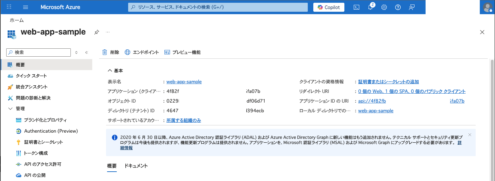
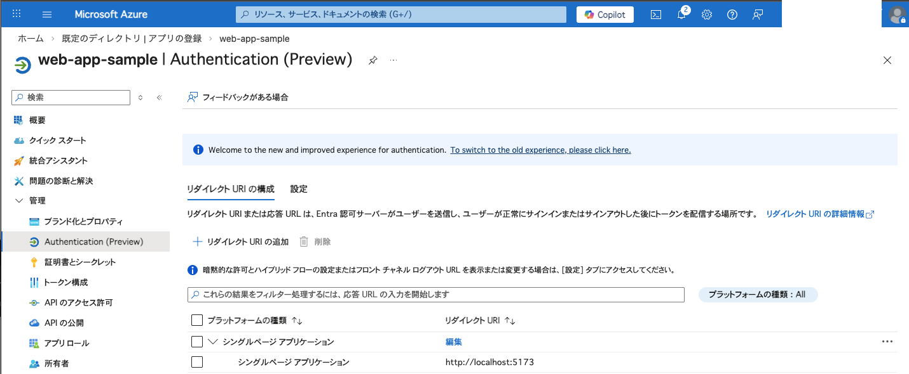
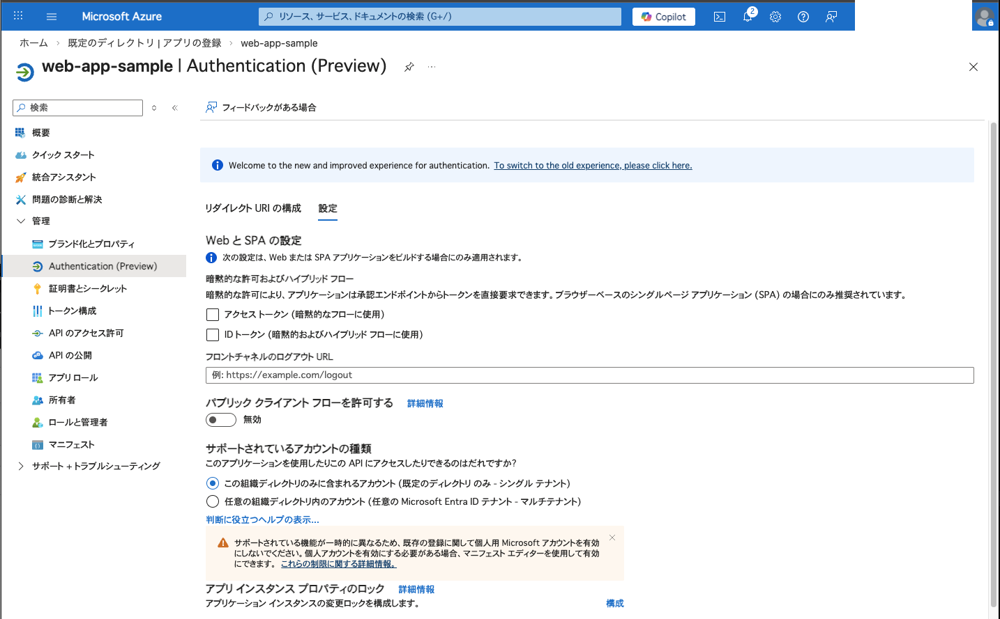
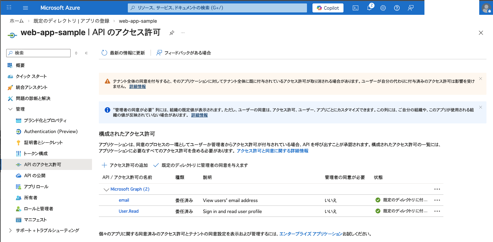
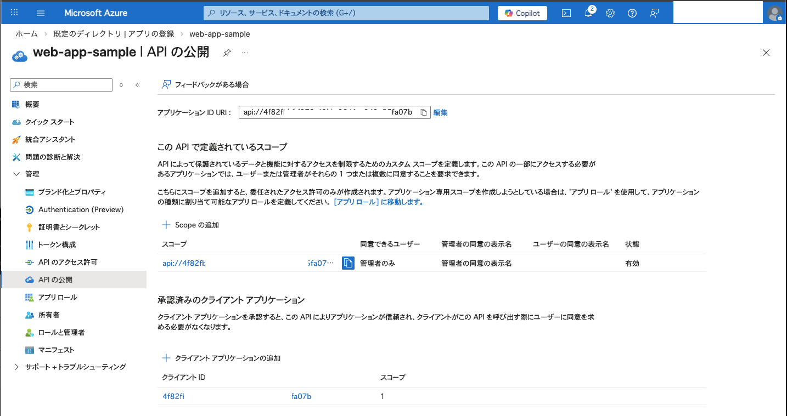
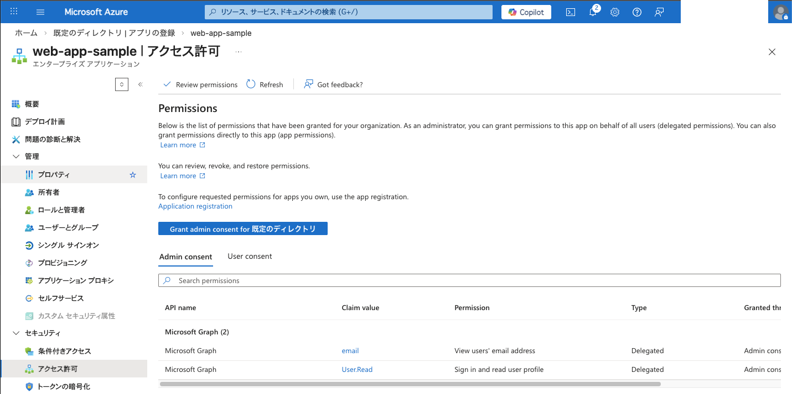

# Entra ID OIDC Sample SPA

このプロジェクトは、React と `react-oidc-context` を使用して、Microsoft Entra ID (旧 Azure AD) との OIDC 認証を試すための最低限のサンプルアプリケーションです。

## プロジェクト構成

- `src/main.jsx`: `AuthProvider` による OIDC 設定の初期化
- `src/App.jsx`: `useAuth` フックを使用したログイン状態の管理と UI
- `.env`: 認証設定（テナント ID、クライアント ID）の保持

## セットアップ手順

### 1. Microsoft Entra ID でのアプリ登録

1.  [Azure ポータル](https://portal.azure.com/)にアクセスし、「Microsoft Entra ID」を選択します。
2.  「アプリの登録」→「新規登録」をクリックします。
3.  名前を入力し（例: `web-app-sample`）、サポートされているアカウントの種類を選択します。
4.  「登録」をクリック後、左メニューの「認証」を選択します。
5.  「プラットフォームを追加」→「シングルページ アプリケーション (SPA)」をクリックします。
6.  リダイレクト URI に `http://localhost:5173` を入力し、「構成」をクリックします。

#### （参考）アプリ登録の設定例を以下に掲載しておきます。

* 概要


* 管理 -> Authentication (Preview)：リダイレクトURIの構成


* 管理 -> Authentication (Preview)：設定


* 管理 -> API のアクセス許可


* 管理 -> API の公開


* セキュリティ -> アクセス許可　※これは「エンタープライズ アプリケーション」の設定です


### 2. 環境変数の設定

ローカル開発用の設定ファイルを作成します。Vite の仕様により、`.env.local` ファイルは自動的に読み込まれ、他の設定ファイルよりも優先されます。

1.  `.env.sample1` または `.env.sample2` をコピーして `.env.local` を作成します。
2.  `.env.local` 内の以下の値を実際の環境に合わせて書き換えます。
    - `VITE_OIDC_AUTHORITY`: `https://login.microsoftonline.com/{あなたのテナントID}/v2.0`
    - `VITE_OIDC_CLIENT_ID`: 登録したアプリの「アプリケーション (クライアント) ID」
    - `VITE_OIDC_SCOPE`: 要求するスコープ（例: `openid profile email`）。

### 3. アプリケーションの実行

使用する設定ファイルに応じて、以下のコマンドで起動します。

```bash
# 依存関係のインストール
npm install

# 個人設定 (.env.local) を使用して起動
# ※ Vite の仕様により、.env.local が存在すれば自動的に優先読み込みされます
npm run dev

# .env.sample1 を使用して起動
npm run dev:sample1

# .env.sample2 を使用して起動
npm run dev:sample2
```

起動後、 `http://localhost:5173` にアクセスしてください。

## 使い方

1.  **Log in**: クリックすると Entra ID のサインイン画面にリダイレクトされます。
2.  **認証後**: ログインに成功すると、画面に取得したユーザーのプロファイル情報（ID トークンのクレーム）が表示されます。
3.  **Log out**: クリックすると Entra ID からサインアウトし、アプリケーションに戻ります。
4.  **Clear Storage**: ローカルに保存されているセッション情報をクリアします（デバッグ用）。

## 技術情報

- **ライブラリ**: `react-oidc-context` ( `oidc-client-ts` の React ラッパー)
- **認証フロー**: Authorization Code Flow with PKCE (SPA で推奨されるフロー)

## 技術情報
